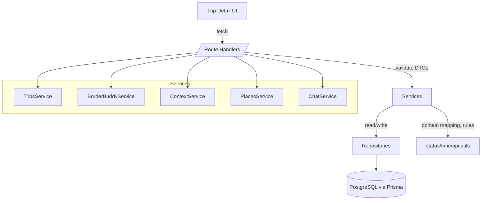

# Travel Tab Brownfield Enhancement Architecture

## Introduction
This document outlines the architectural approach for enhancing Travel Tab with a refactor focused on clean separation of concerns across the front end and backend, improved layering (transport/service/repository), and upgraded coding standards. Its primary goal is to serve as the guiding architectural blueprint for AI-driven development of new features while ensuring seamless integration with the existing system.

**Relationship to Existing Architecture**
This document supplements the current Next.js App Router monolith by defining standard layers and boundaries between UI, API handlers, domain/services, and data access. Where conflicts arise between new and existing patterns, this document will guide consistent refactoring toward a clearer separation of concerns while preserving working functionality.

## Existing Project Analysis

### Current Project State
- **Primary Purpose:** AI-powered travel compliance and trip management (user auth, trips CRUD, status tracking).
- **Current Tech Stack:** Next.js 15 (App Router), TypeScript, Tailwind CSS v4, shadcn/ui, Prisma ORM with PostgreSQL, JWT auth via httpOnly cookie, Zod for validation, ESLint (Next + TS).
- **Architecture Style:** Single Next.js application with serverless API routes; thin API handlers calling lib services; basic domain/utility separation.
- **Deployment Method:** Not documented. Assumption: Next.js on Vercel or a Node host; Prisma against managed Postgres.

### Available Documentation
- `docs/prd.md`, `docs/project-brief.md`, and a front-end spec.
- No prior `docs/architecture.md` found. No explicit ADRs.
- No formal API contract docs; implicit via `src/app/api/*` handlers.

### Identified Constraints
- Env dependencies: `DATABASE_URL`, `JWT_SECRET` required; failures if missing.
- Prisma client duplication: both `src/lib/db.ts` and `src/lib/prisma.ts` export clients; risk of multiple instances/import confusion.
- Auth: JWT verified in server context; middleware uses presence-only check (cannot verify JWT in Edge), so protected routes rely on cookie existence, not full verification.
- Data modeling: UI status strings differ from enum; mapping handled in `lib/trips.ts`. Risk of drift; consider canonical mapping utilities.
- Source anomaly: `src/components/Users/brii/Desktop/.../icons/index.tsx` appears accidental; should be removed.
- Testing framework not configured; no automated coverage gate.
- No centralized error model/Result type for API handlers; ad-hoc responses across routes.

## Change Log
| Change | Date | Version | Description | Author |
| - | - | - | - | - |
| Initial draft | 2025-09-09 | 0.1 | Brownfield architecture workflow started | Architect |

## Remediation Tasks (Developer‑Actionable)
These items address specific risks found in the current codebase. Implement incrementally; each task is safe and self‑contained.

1) Unify Prisma Client
- Keep `src/lib/db.ts` as the single Prisma client factory. Deprecate and remove `src/lib/prisma.ts`.
- Update imports to `import { prisma } from '@/lib/db'` everywhere.
- Rationale: Avoid multiple client instances and import confusion that can cause connection churn.

2) Consolidate Status Mapping
- Create `src/lib/status.ts` exporting `toDisplayStatus(db: TripStatus) => UIStatus` and `fromDisplayStatus(ui: UIStatus) => TripStatus`.
- Replace ad‑hoc mappings in `src/lib/trips.ts` (and elsewhere) with these functions.
- Rationale: Prevent drift between DB enum (`Planning | Ready_to_Go | In_Progress | Completed`) and UI labels.

3) Standardize API Responses
- Add `src/lib/api.ts` with helpers: `ok<T>(data: T)`, `fail(code: string, message: string, details?: unknown)` and a `toNextResponse(result)` wrapper for route handlers.
- Refactor existing routes under `src/app/api/**` to return a consistent envelope: `{ success, data?, error? }` with proper HTTP status.
- Rationale: Consistent error handling simplifies clients and testing.

4) Auth Guard Posture
- Keep middleware cookie‑presence redirect (Edge cannot verify HMAC JWT safely with `jsonwebtoken`).
- Enforce real auth in all API route handlers using `getCurrentUser()` as the source of truth.
- Optional: Add a server‑side guard in protected layouts/pages to fetch the current user and redirect if absent.
- Rationale: Balanced UX without fragile Edge verification.

5) Remove Stray Source File
- Delete accidental path: `src/components/Users/brii/Desktop/code/travel-tab/src/components/icons/index.tsx`.
- Rationale: Prevent tooling confusion and noisy imports.

6) Validate Required Environment
- Document and validate `DATABASE_URL` and `JWT_SECRET` at startup via a tiny `src/server/config/env.ts` that throws descriptive errors in development and logs clearly in production.
- Rationale: Fail fast with actionable messages for common misconfigurations.

7) Testing Baseline
- Add Vitest + React Testing Library and scripts: `test`, `test:watch`, `test:coverage`.
- High‑value tests to add first:
  - Status mapping util (`src/lib/status.ts`).
  - API response helper (`src/lib/api.ts`).
  - Trips repository/service happy paths and validation failures.
- Rationale: Establish a minimal quality gate before deeper refactors.

8) Folder Structure For Separation of Concerns
- Introduce internal layers without changing deployment model:
  - `src/server/repositories/*` – Prisma calls only.
  - `src/server/services/*` – business logic, orchestration, validation.
  - `src/server/contracts/*` – DTOs and Zod schemas shared at boundaries.
  - `src/server/errors/*`, `src/server/config/*`, `src/server/logging/*` – cross‑cutting concerns.
- Move logic from `src/lib/trips.ts` into `repositories/trips.repo.ts` and `services/trips.service.ts` (keep `src/lib` for UI‑only helpers).
- Rationale: Clear testable seams and future‑proofing for scale.

9) Logging And Observability (Lightweight)
- Add a tiny logger (`src/server/logging/logger.ts`) with levelled logs and safe redaction of sensitive fields.
- Use in API handlers and services for error reporting and key events.

10) Documentation And ADRs
- After each substantive decision (e.g., JWT posture, response envelope), add a short ADR in `docs/adrs/ADR-XXXX-title.md`.
- Keep this architecture document as the living source; link ADRs where relevant.

Implementation Notes
- Make these changes in small PRs (tasks 1–5 first), running `npm run lint` after each.
- Avoid functional changes while moving code; refactor behavior‑preserving and rely on tests.

## Component Architecture

Validation checkpoint
The components below follow the patterns present in your codebase (Next App Router route handlers, lib utilities, Prisma) but introduce clear layers. Integration interfaces respect your current module boundaries. Please confirm this matches your project’s reality before we proceed.

### New Server Modules (Separation of Concerns)
- Transport (HTTP): `src/app/api/**`
  - Thin handlers: parse/validate → call services → map Result to HTTP.

- Services: `src/server/services/*`
  - `trips.service.ts`: list/create trips; delegates to repositories; applies status mapping.
  - `borderbuddy.service.ts`: idempotent enablement, fetch current state, orchestration.
  - `context.service.ts`: persist and retrieve BorderBuddy context form values per trip.
  - `places.service.ts`: generate and store a simple list of places via OpenAI using trip + context.
  - `chat.service.ts`: append/list messages; call OpenAI for replies.

- Repositories: `src/server/repositories/*`
  - `trips.repo.ts`, `borderbuddy.repo.ts`, `context.repo.ts`, `places.repo.ts`, `chat.repo.ts`.
  - Prisma only. No business logic.

- Contracts and Validation: `src/server/contracts/*`
  - Zod DTOs shared by transport/services; response models for consistent API envelopes.

- Cross‑cutting: `src/server/errors/*`, `src/server/config/*`, `src/server/logging/*`.

### Supporting Utilities
- `src/lib/status.ts`: `toDisplayStatus` / `fromDisplayStatus` (single source of truth).
- `src/lib/api.ts`: `ok`, `fail`, `toNextResponse` helpers for handlers.
- `src/lib/time.ts`: due date helpers (`addDaysUTC`, `isOverdue(dueDate, now)`), pure and tested.

### Route Handlers (Proposed)
- `/api/trips` GET/POST → `trips.service`
- `/api/trips/[tripId]/borderbuddy` POST (enable idempotent) → `borderbuddy.service`
- `/api/trips/[tripId]/borderbuddy/context` GET/PUT → `context.service`
- `/api/trips/[tripId]/borderbuddy/places` GET/POST → `places.service`
- `/api/trips/[tripId]/borderbuddy/chat/messages` GET/POST → `chat.service`

### Frontend Composition
- Trip Detail page adds a BorderBuddy tab with panes:
  - ContextPane (editable context form)
  - ChatPane (messages list + input)
  - PlacesPane (generated simple list)
- Keep local/route loaders; avoid global state until needed.

### Component Interaction Diagram (Mermaid)


### Boundaries and Responsibilities
- Handlers never call Prisma directly; only services. Services never import `next/server`.
- Repositories return primitives/records; mapping to UI shapes happens in services.
- All user scoping enforced in repositories (by `userId`) and validated again in services.

### Rationale
- Introduces clear seams for testing and future extraction without changing deployment.
- Minimizes coupling: transport ↔ services ↔ repositories with thin adapters.

## API Design and Integration

### API Integration Strategy
- Authentication: JWT in httpOnly cookie `auth-token`. Each route handler reads `getCurrentUser()` and returns 401 if absent.
- Authorization: For trip‑scoped endpoints, verify the trip belongs to the authenticated user; repositories always filter by `userId`.
- Validation: All inputs validated via Zod DTOs in `src/server/contracts/*`. Reject with 400 and `{ success:false, error:{ code:"VALIDATION_ERROR", message } }`.
- Response Envelope: Standardize on `{ success, data?, error? }` and set appropriate HTTP statuses (200/201/204/400/401/403/404/409/500).
- Idempotency: `POST /borderbuddy` creates if missing; if already exists, return 200 with existing resource.
- LLM: Chat and places are powered by OpenAI via `OPENAI_API_KEY`; redact sensitive inputs and include disclaimers.
- Versioning: MVP unversioned paths; include `X-API-Version: 0` response header. Future: promote to `/api/v1/*` if needed.
- CSRF: Same‑site `lax` cookie; assume same‑origin fetch from the app. For cross‑site forms, add CSRF token later if required.

### New Endpoints

1) Trips
- GET `/api/trips` — List authenticated user trips
  - Response 200:
    ```json
    { "success": true, "data": { "trips": [ {"id":"...","title":"...","destination":"US","startDate":"YYYY-MM-DD","endDate":"YYYY-MM-DD","status":"Planning"} ] } }
    ```
- POST `/api/trips` — Create a trip
  - Request:
    ```json
    { "title":"...", "destination":"US", "purpose":"Tourism", "startDate":"YYYY-MM-DD", "endDate":"YYYY-MM-DD" }
    ```
  - Responses: 201 on success; 400 validation; 401 unauthorized

2) BorderBuddy Enablement
- POST `/api/trips/{tripId}/borderbuddy` — Create/enable BorderBuddy (idempotent)
  - Response 201 (created) or 200 (existing):
    ```json
    { "success": true, "data": { "borderBuddy": { "id":"...","tripId":"...","enabledAt":"..." } } }
    ```
  - Errors: 401/403 if not owner; 404 if trip not found; 409 on unique violation (should be caught and mapped to 200 with existing)

3) BorderBuddy Context
- GET `/api/trips/{tripId}/borderbuddy/context` — Get current context form values
- PUT `/api/trips/{tripId}/borderbuddy/context` — Create/update context form

4) Places
- GET `/api/trips/{tripId}/borderbuddy/places` — Get latest generated places list
- POST `/api/trips/{tripId}/borderbuddy/places` — Generate (or regenerate) places list via OpenAI using trip + context

5) Chat
- GET `/api/trips/{tripId}/borderbuddy/chat/messages?cursor=...&limit=50` — List messages (most recent first or paginated)
- POST `/api/trips/{tripId}/borderbuddy/chat/messages` — Append a user message and stream or batch an assistant reply via OpenAI

### Error Model
- Codes: `VALIDATION_ERROR`, `UNAUTHORIZED`, `FORBIDDEN`, `NOT_FOUND`, `CONFLICT`, `SERVER_ERROR`.
- Include `meta.timestamp` and optional `requestId` header echo for traceability.

### Rationale
- Endpoints align with PRD stories (FR2–FR7) and NFRs. Idempotent enablement, persisted context, OpenAI-backed chat, and a simple places list meet the MVP scope without maps.

## External API Integration

MVP uses OpenAI for chat and places suggestions via `OPENAI_API_KEY`. No Google Maps or government APIs in MVP.

- Current External Integrations: None required for MVP.
- Country Data: Use a local ISO country list (already present under `src/constants/data.ts`).
- Future‑proofing:
  - Define an interface `ExternalComplianceProvider` in `src/server/contracts/providers.ts` with methods like `getVisaRequirements(input): Promise<Result<...>>`.
  - Keep a `LocalRulesProvider` implementation for MVP; later, a `GovApiProvider` can implement the same interface without changing services.
- Security & Privacy: When/if external calls are added, ensure timeouts, retry with backoff, input redaction, and never send high‑sensitivity PII (NFR7).

## Source Tree Integration

Goal: Introduce a layered structure while minimizing disruption. Keep UI paths stable; move domain logic behind services/repositories.

### Proposed Structure
```
src/
  app/
    api/                     # route handlers (transport)
    ...                      # pages/layouts/components stay as-is
  server/
    services/
      trips.service.ts
      borderbuddy.service.ts
      context.service.ts
      places.service.ts
      chat.service.ts
    repositories/
      trips.repo.ts
      borderbuddy.repo.ts
      context.repo.ts
      places.repo.ts
      chat.repo.ts
    contracts/
      trips.dto.ts
      borderbuddy.dto.ts
      context.dto.ts
      places.dto.ts
      chat.dto.ts
      providers.ts            # optional, for future external APIs
    errors/
      index.ts
    config/
      env.ts
    logging/
      logger.ts
  lib/
    api.ts                   # response helpers
    status.ts                # status mapping (DB <-> UI)
    time.ts                  # date helpers (if needed)
    utils.ts                 # UI-safe helpers only
```

### Migration Plan (Incremental)
1) Create folders under `src/server/*` and add `env.ts`, `logger.ts`, empty repo/service files.
2) Move Trip logic out of `src/lib/trips.ts`:
   - Data access → `repositories/trips.repo.ts` (Prisma only)
   - Mapping/validation/business logic → `services/trips.service.ts`
   - Update `src/app/api/trips/route.ts` to call `trips.service` and to use `lib/api.ts` response helpers.
3) Add `src/lib/status.ts` and replace mapping functions in code with imports from this module.
4) Add `src/lib/api.ts` and refactor existing auth/trips routes to consistent envelopes.
5) Remove `src/lib/prisma.ts` and standardize imports to `@/lib/db`.
6) Introduce BorderBuddy entities (repo/service) alongside new routes; keep Trip flows unchanged.
7) Add tests for status mapping, api helpers, and trips service.

### Naming and Conventions
- Files use kebab or dot suffixes (`*.service.ts`, `*.repo.ts`, `*.dto.ts`).
- Services never import `next/*`; route handlers never import Prisma directly.
- Shared types live in `src/server/contracts` or `src/types` depending on UI exposure.

### Risk Controls
- Each migration step preserves behavior; validate with manual smoke tests and, once added, unit tests.
- Keep PRs small: unify Prisma and status mapping before introducing new entities.

## Enhancement Scope and Integration Strategy

### Enhancement Overview
- Enhancement Type: Brownfield refactor + MVP features (BorderBuddy: context form, chat, places).
- Scope: Introduce clear layering (transport → services → repositories), domain contracts, and persistence for BorderBuddy context, chat, and places. Preserve existing endpoints while migrating logic behind services.
- Integration Impact: Medium–High (new layers and entities) but incremental and backwards‑compatible.

### Integration Approach
- Code Integration Strategy:
  - Layers: `app/api` (transport only), `server/services` (business rules), `server/repositories` (Prisma), `server/contracts` (DTO/Zod), cross‑cutting in `server/{errors,config,logging}`.
  - Migration: Move logic from `src/lib/trips.ts` into `services/trips.service.ts` and `repositories/trips.repo.ts`. Keep `src/lib` for UI‑safe helpers.
  - Prisma client: Standardize on `src/lib/db.ts`; remove `src/lib/prisma.ts`.
  - Error model: Use a small `{ ok, fail, toNextResponse }` helper to normalize envelopes.
- Database Integration:
  - Add entities for BorderBuddy, BorderBuddyContext, PlacesRecommendation, ChatMessage.
  - Backward compatible: Trip/User unchanged aside from optional `purpose` and `nationality`.
- API Integration:
  - Keep `/api/trips` behavior; add new endpoints for enablement, context, places, and chat.
  - Validate all inputs with Zod; scope queries by `userId`.
- UI Integration:
  - Trip Detail adds a BorderBuddy tab with Context, Chat, and Places panes.
  - Deterministic regeneration preserves history and updates current view.

### Compatibility Requirements
- API: Existing clients remain compatible; new endpoints are additive.
- Database: Additive migrations only; safe defaults for new columns.
- UI/UX: Maintain Tailwind/shadcn patterns and accessibility.
- Performance: Deterministic generation within ~3s median; no external APIs per PRD.

## Tech Stack Alignment

### Existing Technology Stack
- Runtime: Node.js LTS (prefer 20.x)
- Framework: Next.js 15 (App Router)
- Language: TypeScript ^5 (strict)
- Styling/UI: Tailwind CSS v4, shadcn/ui
- ORM/DB: Prisma ^6 with PostgreSQL
- Auth: jsonwebtoken + bcryptjs; httpOnly cookie sessions
- Validation: Zod
- Linting: ESLint ^9 with Next config
- Build: Turbopack

### New Technology Additions
- Testing: vitest, @testing-library/react, @testing-library/jest-dom, @testing-library/user-event, jsdom
  - Purpose: Baseline unit/component tests and CI coverage
  - Integration: `vitest.config.ts`; scripts `test`, `test:watch`, `test:coverage`
- Env Validation: Zod‑based `server/config/env.ts`
  - Purpose: Fail fast on `DATABASE_URL`, `JWT_SECRET`
- Logging (lightweight): `server/logging/logger.ts` or consola
  - Purpose: Consistent, redactable logs for API/services

Rationale: Keep current stack to minimize churn; add only what materially improves reliability and testability.

## Data Models and Schema Changes

### New Data Models
- BorderBuddy
  - One per Trip (idempotent enablement)
  - Fields: `id`, `tripId` (UNIQUE), `enabledAt`, `createdAt`, `updatedAt`

- BorderBuddyContext
  - Persisted form inputs to enrich prompts
  - Fields: `id`, `borderBuddyId` (UNIQUE), `interests` String[]?, `regions` String[]?, `budget` String?, `style` String?, `constraints` String[]?, `updatedAt`, timestamps

- PlacesRecommendation
  - Latest generated places list per trip
  - Fields: `id`, `borderBuddyId` (UNIQUE), `generatedAt`, `items` (JSON array of { name, description, tags?, region? }), timestamps

- ChatMessage
  - Persisted chat per trip
  - Fields: `id`, `borderBuddyId`, `role` (User|Assistant), `content`, `createdAt`, `updatedAt`

### Updates to Existing Models
- Trip: `purpose` Enum or String (default 'Other')

### Schema Integration Strategy
- New Tables: BorderBuddy, BorderBuddyContext, PlacesRecommendation, ChatMessage
- Modified Tables: Trip (+purpose)
- Indexes: UNIQUE(tripId) on BorderBuddy; UNIQUE(borderBuddyId) on BorderBuddyContext and PlacesRecommendation; indexes on FKs and `createdAt` as listed.
- Migration: Additive changes; create BorderBuddy lazily on enablement; no destructive changes.
- Backward Compatibility: Existing Trip flows unaffected; new endpoints are additive.

## Coding Standards and Conventions

- TypeScript: strict mode; explicit return types for exported functions; avoid `any` (prefer `unknown` + narrowing).
- Boundaries: `app/api` (transport) → `server/services` (business rules) → `server/repositories` (Prisma). Do not cross boundaries.
- Validation: Zod schemas at HTTP boundary and in `contracts/*`; reuse across services where feasible.
- API Envelope: `{ success, data?, error? }` with standard error codes and appropriate HTTP statuses.
- Error Handling: Services return typed errors/Results; route handlers map to HTTP with `lib/api.ts`.
- Dates/Time: Use UTC for all server calculations and DB; helpers in `lib/time.ts`.
- Styling/UI: Tailwind utility classes grouped logically; shadcn/ui patterns; maintain a11y (focus-visible, roles, labels).
- Imports: Use `@/*` alias; avoid brittle deep relative imports.
- Naming: files `kebab-case`, types `PascalCase`, functions/variables `camelCase`; enums `PascalCase` with `PascalCase` members.
- Linting: ESLint errors at zero; only local disables with justification.
- Commits: Conventional Commits.

## Testing Strategy

- Tooling: Vitest + React Testing Library; Node environment for services/repos; jsdom for components.
- Coverage: Aim ≥80% for services and core libs; focus UI tests on critical flows.
- Types of tests:
  - Unit: `status.ts`, `api.ts`; services with repo and OpenAI client mocks.
  - Integration: repositories against a test DB (or Prisma sqlite) and route handlers invoked as pure functions.
  - UI: Trips list, create trip form validation, BorderBuddy context form and chat interactions.
- Layout: co-locate `*.test.ts(x)` with source; `tests/setup.ts` initializes RTL, jest-dom.
- Scripts: `test`, `test:watch`, `test:coverage`.

Initial tests to add
- Status mapping round-trip and unknown/default handling.
- API helper maps typed errors to HTTP 4xx/5xx and envelope.
- Trips service validates dates, calls repo, and maps status correctly.
- Chat service builds system/user messages correctly and handles OpenAI responses and errors.
- Places service prompts OpenAI and parses list structure (name + description) robustly.

## Security Integration

- Authentication: Verify JWT on server in route handlers; never trust only the cookie in middleware.
- Authorization: Repos always filter by `userId`; services double-check ownership and throw `FORBIDDEN` if mismatched.
- Cookies: `httpOnly`, `sameSite:'lax'`, `secure: production`, `path:'/'`.
- JWT: HS256, 7d expiry; minimal claims; rotate secret per environment.
- Passwords: bcrypt with reasonable cost; never log sensitive data.
- Input Validation: Zod for all external inputs; reject early with helpful messages.
- Logging: Redact tokens/emails; structured error logs via `server/logging/logger.ts`.
- Secrets/Env: Validate `DATABASE_URL`, `JWT_SECRET` in `server/config/env.ts`; never commit `.env*`.
- Future hardening: rate limiting, CSRF token if cross-site forms, basic audit events.

## Checklist Results Report
TBD — Run architect-checklist after initial implementation to validate consistency and surface risks.

## Next Steps

### Story Manager Handoff
- Reference: `docs/architecture.md`.
- Key requirements: layered structure, unified Prisma client, standardized response envelope, OpenAI-backed chat and places.
- Constraints: No external APIs (MVP); protect user data; sustain a11y.
- Stories (sequence):
  1) Unify Prisma; add `lib/status.ts` and `lib/api.ts`; refactor `/api/trips`.
  2) Introduce `server/repositories` and `server/services` for Trips; move logic from `lib/trips.ts`.
  3) Add BorderBuddy schema + migrations; implement enablement endpoint.
  4) Implement context form, chat (OpenAI), and places endpoints.

### Developer Handoff
- Create `src/server/{repositories,services,contracts,config,errors,logging}` stubs.
- Implement `lib/status.ts` and `lib/api.ts`; refactor trips route.
- Remove `src/lib/prisma.ts`; standardize imports to `@/lib/db`.
- Add unit tests for helpers and trips service skeleton.
- Prepare Prisma migrations for BorderBuddy, BorderBuddyContext, PlacesRecommendation, ChatMessage, and Trip additions.
