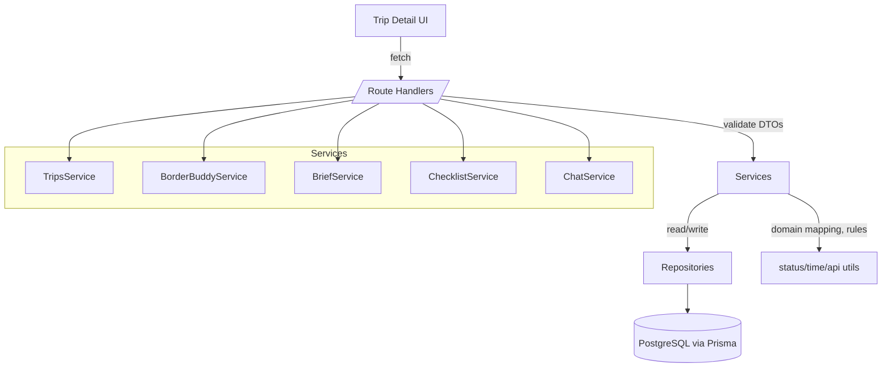

# Component Architecture

Validation checkpoint
The components below follow the patterns present in your codebase (Next App Router route handlers, lib utilities, Prisma) but introduce clear layers. Integration interfaces respect your current module boundaries. Please confirm this matches your project’s reality before we proceed.

## New Server Modules (Separation of Concerns)
- Transport (HTTP): `src/app/api/**`
  - Thin handlers: parse/validate → call services → map Result to HTTP.

- Services: `src/server/services/*`
  - `trips.service.ts`: list/create trips; delegates to repositories; applies status mapping.
  - `borderbuddy.service.ts`: idempotent enablement, fetch current state, orchestration.
  - `context.service.ts`: persist and retrieve BorderBuddy context form values per trip.
  - `places.service.ts`: generate and store a simple list of places via OpenAI using trip + context.
  - `chat.service.ts`: append/list messages; call OpenAI for replies.

- Repositories: `src/server/repositories/*`
  - `trips.repo.ts`, `borderbuddy.repo.ts`, `context.repo.ts`, `places.repo.ts`, `chat.repo.ts`.
  - Prisma only. No business logic.

- Contracts and Validation: `src/server/contracts/*`
  - Zod DTOs shared by transport/services; response models for consistent API envelopes.

- Cross‑cutting: `src/server/errors/*`, `src/server/config/*`, `src/server/logging/*`.

## Supporting Utilities
- `src/lib/status.ts`: `toDisplayStatus` / `fromDisplayStatus` (single source of truth).
- `src/lib/api.ts`: `ok`, `fail`, `toNextResponse` helpers for handlers.
- `src/lib/time.ts`: due date helpers (`addDaysUTC`, `isOverdue(dueDate, now)`), pure and tested.

## Route Handlers (Proposed)
- `/api/trips` GET/POST → `trips.service`
- `/api/trips/[tripId]/borderbuddy` POST (enable idempotent) → `borderbuddy.service`
- `/api/trips/[tripId]/borderbuddy/context` GET/PUT → `context.service`
- `/api/trips/[tripId]/borderbuddy/places` GET/POST → `places.service`
- `/api/trips/[tripId]/borderbuddy/chat/messages` GET/POST → `chat.service`

## Frontend Composition
- Trip Detail page adds a BorderBuddy tab with panes:
  - ContextPane (editable context form)
  - ChatPane (messages list + input)
  - PlacesPane (generated simple list)
- Keep local/route loaders; avoid global state until needed.

## Component Interaction Diagram (Mermaid)

## Boundaries and Responsibilities
- Handlers never call Prisma directly; only services. Services never import `next/server`.
- Repositories return primitives/records; mapping to UI shapes happens in services.
- All user scoping enforced in repositories (by `userId`) and validated again in services.

## Rationale
- Introduces clear seams for testing and future extraction without changing deployment.
- Minimizes coupling: transport ↔ services ↔ repositories with thin adapters.
